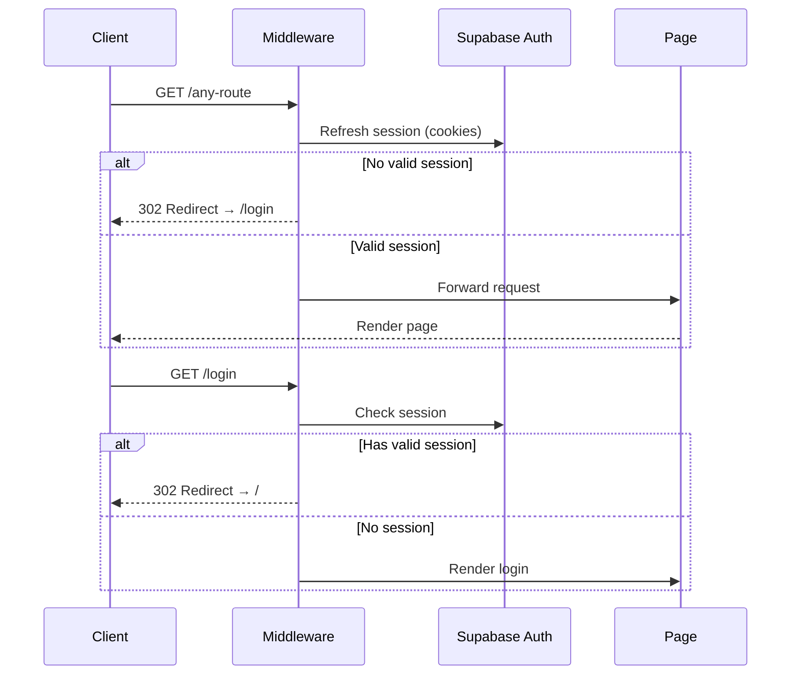

# API Specification — Nurse Shift & OT Management System

## Overview

This system uses **Next.js Server Actions** (not traditional REST endpoints) for all data mutations. Server Actions are invoked as RPC calls from client components and execute server-side with the user's Supabase session.

All actions are defined in [`src/lib/supabase/actions.ts`](../src/lib/supabase/actions.ts).

> **Authentication:** Every action uses the server-side Supabase client which reads the session from HTTP-only cookies. No explicit auth headers are needed — the middleware handles session refresh automatically.

---

## 1. Authentication

### 1.1 Sign In (Client-Side)

**Method:** Supabase JS Client (`supabase.auth.signInWithPassword`)

```typescript
// Invoked directly from LoginPage component
const { error } = await supabase.auth.signInWithPassword({
  email: `${username}@nurse.local`,  // Username mapped to email format
  password: password,
});
```

| Field | Type | Description |
|---|---|---|
| `email` | `string` | `"username@nurse.local"` format |
| `password` | `string` | User password |

**Response:** Sets session cookies via `@supabase/ssr`. On success, client calls `router.push('/')`.

**Error:** `{ error: { message: string } }` — displayed as Thai error text.

---

### 1.2 Sign Out

**Method:** Server Action

```typescript
export async function signOut(): Promise<void>
```

Clears the Supabase session and cookies.

---

## 2. Profile Actions

### 2.1 Get Current Profile

```typescript
export async function getCurrentProfile(): Promise<Profile | null>
```

| | Description |
|---|---|
| **Auth** | Requires authenticated session |
| **Response** | `Profile` object or `null` if no session |

**Response Schema:**

```typescript
interface Profile {
  id: string;           // UUID
  username: string;
  full_name: string;
  role: 'nurse' | 'admin';
  created_at: string;   // ISO 8601
  updated_at: string;   // ISO 8601
}
```

---

### 2.2 Get All Profiles (Admin Only)

```typescript
export async function getAllProfiles(): Promise<Profile[]>
```

| | Description |
|---|---|
| **Auth** | Requires admin role (enforced by RLS) |
| **Response** | Array of all `Profile` records, ordered by `full_name` |

---

## 3. Shift Actions

### 3.1 Get Shifts for Period

```typescript
export async function getShiftsForPeriod(
  userId: string,
  periodKey: string
): Promise<Shift[]>
```

| Parameter | Type | Description |
|---|---|---|
| `userId` | `string` (UUID) | Nurse's profile ID |
| `periodKey` | `string` | Period key, e.g. `"2026-02"` |

**Behavior:** Resolves the period key to a date range (16th prev month → 15th current month), then queries shifts within that range for the user.

**Response Schema:**

```typescript
interface Shift {
  id: string;
  user_id: string;
  date: string;                       // "YYYY-MM-DD"
  sched_start: string;                // ISO 8601 timestamp
  sched_end: string;
  actual_start: string | null;
  actual_end: string | null;
  calculated_afternoon_hours: number;  // Auto-calculated
  calculated_ot_hours: number;         // Auto-calculated
  notes: string | null;
  created_at: string;
  updated_at: string;
}
```

---

### 3.2 Upsert Shift

```typescript
export async function upsertShift(shift: {
  user_id: string;
  date: string;
  sched_start: string;
  sched_end: string;
  actual_start: string | null;
  actual_end: string | null;
  notes: string | null;
}): Promise<{ success: boolean; error?: string }>
```

| Parameter | Type | Required | Description |
|---|---|---|---|
| `user_id` | `string` (UUID) | ✅ | Nurse ID |
| `date` | `string` | ✅ | `"YYYY-MM-DD"` |
| `sched_start` | `string` | ✅ | ISO 8601 timestamp |
| `sched_end` | `string` | ✅ | ISO 8601 timestamp |
| `actual_start` | `string \| null` | ❌ | ISO 8601 or null |
| `actual_end` | `string \| null` | ❌ | ISO 8601 or null |
| `notes` | `string \| null` | ❌ | Free text |

**Behavior:**
1. Server-side calculates `calculated_afternoon_hours` and `calculated_ot_hours` from the time inputs.
2. Upserts on conflict `(user_id, date)`.
3. Sets `updated_at` to current time.

**Response:**

```typescript
{ success: true }
// or
{ success: false, error: "Error message" }
```

---

### 3.3 Delete Shift

```typescript
export async function deleteShift(
  shiftId: string
): Promise<{ success: boolean; error?: string }>
```

| Parameter | Type | Description |
|---|---|---|
| `shiftId` | `string` (UUID) | Shift record ID |

**Auth:** RLS ensures only the owner can delete their own shift.

---

## 4. Monthly Summary Actions

### 4.1 Get Monthly Summary

```typescript
export async function getMonthlySummary(
  userId: string,
  periodKey: string
): Promise<MonthlySummary | null>
```

| Parameter | Type | Description |
|---|---|---|
| `userId` | `string` (UUID) | Nurse ID |
| `periodKey` | `string` | e.g. `"2026-02"` |

**Response Schema:**

```typescript
interface MonthlySummary {
  id: string;
  user_id: string;
  month_period: string;
  prev_month_afternoon_carry_over: number;
  prev_month_ot_carry_over: number;
  total_afternoon_hours: number;
  total_ot_hours: number;
  paid_afternoon_shifts: number;
  paid_ot_shifts: number;
  remaining_afternoon_carry_over: number;
  remaining_ot_carry_over: number;
  status: 'draft' | 'finalized';
  created_at: string;
  updated_at: string;
}
```

---

### 4.2 Get All Monthly Summaries (Admin)

```typescript
export async function getAllMonthlySummaries(
  periodKey: string
): Promise<(MonthlySummary & { profiles: Profile })[]>
```

Returns summaries for all nurses for the given period, with joined profile data.

---

### 4.3 Finalize Monthly Summary (Admin)

```typescript
export async function finalizeMonthlySummary(input: {
  user_id: string;
  month_period: string;
  prev_month_afternoon_carry_over: number;
  prev_month_ot_carry_over: number;
  total_afternoon_hours: number;
  total_ot_hours: number;
  paid_afternoon_shifts: number;
  paid_ot_shifts: number;
  remaining_afternoon_carry_over: number;
  remaining_ot_carry_over: number;
}): Promise<{ success: boolean; error?: string }>
```

| Parameter | Type | Description |
|---|---|---|
| `user_id` | `string` (UUID) | Nurse to finalize |
| `month_period` | `string` | Period key |
| `prev_month_afternoon_carry_over` | `number` | Carry-over from prev month |
| `prev_month_ot_carry_over` | `number` | Carry-over from prev month |
| `total_afternoon_hours` | `number` | Afternoon hours earned this period |
| `total_ot_hours` | `number` | OT hours earned this period |
| `paid_afternoon_shifts` | `number` | 8-hr shifts paid out (admin input) |
| `paid_ot_shifts` | `number` | 8-hr shifts paid out (admin input) |
| `remaining_afternoon_carry_over` | `number` | Calculated: total − paid × 8 |
| `remaining_ot_carry_over` | `number` | Calculated: total − paid × 8 |

**Behavior:**
1. Upserts on conflict `(user_id, month_period)`.
2. Sets `status = 'finalized'`.
3. Auth: RLS restricts to admin role.

---

## 5. Client-Side Utility Functions

These are pure functions used for real-time UI calculations (not server actions).

### 5.1 Shift Calculations (`src/lib/shift-calculations.ts`)

```typescript
// Calculate afternoon hours within scheduled window
calculateAfternoonHours(schedStart: Date, schedEnd: Date): number

// Calculate OT hours beyond scheduled end
calculateOTHours(schedEnd: Date, actualEnd: Date | null): number

// Full breakdown: normal + afternoon + OT
calculateShiftBreakdown(
  schedStart: Date, schedEnd: Date,
  actualStart: Date | null, actualEnd: Date | null
): ShiftBreakdown

// Monthly accumulation with carry-over
calculateMonthlyAccumulation(
  shifts: { afternoonHours: number; otHours: number }[],
  prevAfternoonCarryOver?: number,
  prevOtCarryOver?: number
): MonthlyAccumulation

// Carry-over after payment
calculateCarryOver(totalHours: number, paidShifts: number): number
```

### 5.2 Date Utilities (`src/lib/date-utils.ts`)

```typescript
// Get date range for a period key
getPeriodRange(periodKey: string): PeriodRange

// Determine which period a date belongs to
dateToPeriodKey(date: Date): string

// Get current active period
getCurrentPeriodKey(): string

// Generate available period options for dropdown
getAvailablePeriods(count?: number): PeriodRange[]

// Get all dates within a period
getDatesInPeriod(periodKey: string): Date[]

// Format helpers
formatDateThai(date: Date | string): string
formatTime(dateOrIso: Date | string): string
toDateString(date: Date): string          // "YYYY-MM-DD"
createDateTime(dateStr: string, time: string): Date
createNextDayTime(dateStr: string, time: string): Date
```

---

## 6. Middleware & Auth Flow

### Request Flow



### Route Protection

| Route | Auth Required | Role Required |
|---|---|---|
| `/login` | ❌ | — |
| `/` | ✅ | Any (`nurse` or `admin`) |
| `/admin` | ✅ | `admin` only |
