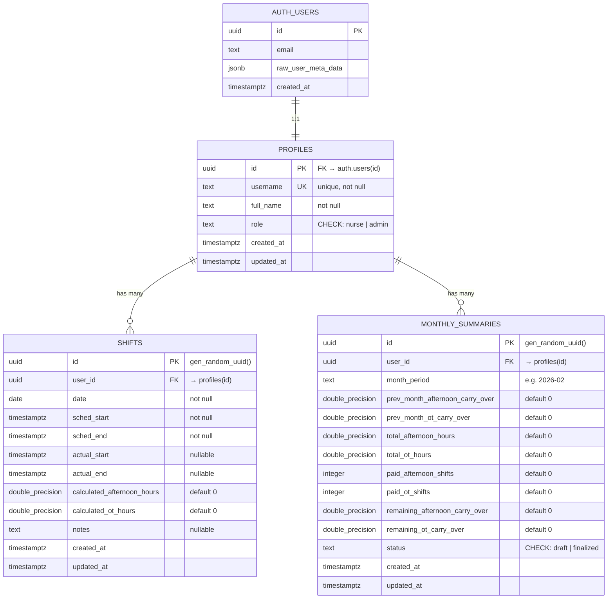

# Database Schema — Nurse Shift & OT Management System

## 1. Overview

The system uses **Supabase PostgreSQL** with three core tables linked to Supabase Auth. Row Level Security (RLS) enforces data isolation between nurses while granting admins full read/write access.

| Table | Purpose | Row Count (est.) |
|---|---|---|
| `profiles` | User identity & role | ~80 |
| `shifts` | Daily shift records | ~2,400/month |
| `monthly_summaries` | Period aggregation & finalization | ~80/month |

---

## 2. ER Diagram



---

## 3. Table Definitions

### 3.1 `profiles`

Linked 1:1 with `auth.users`. Auto-created via trigger on signup.

| Column | Type | Constraints | Description |
|---|---|---|---|
| `id` | `uuid` | PK, FK → `auth.users(id)` ON DELETE CASCADE | User ID from Supabase Auth |
| `username` | `text` | UNIQUE, NOT NULL | Login username (used as email prefix) |
| `full_name` | `text` | NOT NULL | Display name (Thai) |
| `role` | `text` | NOT NULL, DEFAULT `'nurse'`, CHECK `('nurse','admin')` | User role |
| `created_at` | `timestamptz` | NOT NULL, DEFAULT `NOW()` | Record creation time |
| `updated_at` | `timestamptz` | NOT NULL, DEFAULT `NOW()` | Last update time |

### 3.2 `shifts`

One entry per nurse per calendar date. Stores both planned schedule and actual worked times.

| Column | Type | Constraints | Description |
|---|---|---|---|
| `id` | `uuid` | PK, DEFAULT `gen_random_uuid()` | Shift record ID |
| `user_id` | `uuid` | FK → `profiles(id)` ON DELETE CASCADE, NOT NULL | Owner nurse |
| `date` | `date` | NOT NULL | Calendar date of this shift |
| `sched_start` | `timestamptz` | NOT NULL | Planned start time |
| `sched_end` | `timestamptz` | NOT NULL | Planned end time |
| `actual_start` | `timestamptz` | Nullable | Actual clock-in time |
| `actual_end` | `timestamptz` | Nullable | Actual clock-out time |
| `calculated_afternoon_hours` | `double precision` | NOT NULL, DEFAULT `0` | Auto-calculated: scheduled overlap with 16:00–00:00 |
| `calculated_ot_hours` | `double precision` | NOT NULL, DEFAULT `0` | Auto-calculated: actual_end − sched_end |
| `notes` | `text` | Nullable | Free-text notes |
| `created_at` | `timestamptz` | NOT NULL, DEFAULT `NOW()` | |
| `updated_at` | `timestamptz` | NOT NULL, DEFAULT `NOW()` | |

**Unique Constraint:** `UNIQUE(user_id, date)`

### 3.3 `monthly_summaries`

Aggregated period data with admin finalization. One record per nurse per period.

| Column | Type | Constraints | Description |
|---|---|---|---|
| `id` | `uuid` | PK, DEFAULT `gen_random_uuid()` | Summary ID |
| `user_id` | `uuid` | FK → `profiles(id)` ON DELETE CASCADE, NOT NULL | Nurse |
| `month_period` | `text` | NOT NULL | Period key, e.g. `"2026-02"` (end month) |
| `prev_month_afternoon_carry_over` | `double precision` | NOT NULL, DEFAULT `0` | Hours carried from previous period |
| `prev_month_ot_carry_over` | `double precision` | NOT NULL, DEFAULT `0` | Hours carried from previous period |
| `total_afternoon_hours` | `double precision` | NOT NULL, DEFAULT `0` | Sum of afternoon hours earned this period |
| `total_ot_hours` | `double precision` | NOT NULL, DEFAULT `0` | Sum of OT hours earned this period |
| `paid_afternoon_shifts` | `integer` | NOT NULL, DEFAULT `0` | Shifts paid out (set by admin) |
| `paid_ot_shifts` | `integer` | NOT NULL, DEFAULT `0` | Shifts paid out (set by admin) |
| `remaining_afternoon_carry_over` | `double precision` | NOT NULL, DEFAULT `0` | Carry-over to next period |
| `remaining_ot_carry_over` | `double precision` | NOT NULL, DEFAULT `0` | Carry-over to next period |
| `status` | `text` | NOT NULL, DEFAULT `'draft'`, CHECK `('draft','finalized')` | Finalization status |
| `created_at` | `timestamptz` | NOT NULL, DEFAULT `NOW()` | |
| `updated_at` | `timestamptz` | NOT NULL, DEFAULT `NOW()` | |

**Unique Constraint:** `UNIQUE(user_id, month_period)`

---

## 4. Indexes

| Index | Table | Columns | Purpose |
|---|---|---|---|
| `idx_shifts_user_date` | `shifts` | `(user_id, date)` | Fast lookup of a nurse's shifts in a period range |
| `idx_shifts_date` | `shifts` | `(date)` | Admin queries across all nurses for a date range |
| `idx_monthly_summaries_user_period` | `monthly_summaries` | `(user_id, month_period)` | Fast summary lookup |

---

## 5. Row Level Security (RLS)

All tables have RLS enabled. A helper function `public.is_admin()` checks the caller's role.

```sql
CREATE OR REPLACE FUNCTION public.is_admin()
RETURNS BOOLEAN AS $$
  SELECT EXISTS (
    SELECT 1 FROM public.profiles
    WHERE id = auth.uid() AND role = 'admin'
  );
$$ LANGUAGE sql SECURITY DEFINER STABLE;
```

### Policies

| Table | Policy | Operation | Rule |
|---|---|---|---|
| `profiles` | Users can view own profile | SELECT | `auth.uid() = id` |
| `profiles` | Admins can view all profiles | SELECT | `is_admin()` |
| `profiles` | Users can update own profile | UPDATE | `auth.uid() = id` |
| `shifts` | Users can view own shifts | SELECT | `auth.uid() = user_id` |
| `shifts` | Admins can view all shifts | SELECT | `is_admin()` |
| `shifts` | Users can insert own shifts | INSERT | `auth.uid() = user_id` |
| `shifts` | Users can update own shifts | UPDATE | `auth.uid() = user_id` |
| `shifts` | Users can delete own shifts | DELETE | `auth.uid() = user_id` |
| `monthly_summaries` | Users can view own summaries | SELECT | `auth.uid() = user_id` |
| `monthly_summaries` | Admins can view all summaries | SELECT | `is_admin()` |
| `monthly_summaries` | Admins can insert summaries | INSERT | `is_admin()` |
| `monthly_summaries` | Admins can update summaries | UPDATE | `is_admin()` |

---

## 6. Trigger — Auto-Create Profile on Signup

```sql
CREATE OR REPLACE FUNCTION public.handle_new_user()
RETURNS TRIGGER AS $$
BEGIN
  INSERT INTO public.profiles (id, username, full_name, role)
  VALUES (
    NEW.id,
    SPLIT_PART(NEW.email, '@', 1),           -- Extract username from email
    COALESCE(NEW.raw_user_meta_data->>'full_name', SPLIT_PART(NEW.email, '@', 1)),
    COALESCE(NEW.raw_user_meta_data->>'role', 'nurse')
  );
  RETURN NEW;
END;
$$ LANGUAGE plpgsql SECURITY DEFINER;

CREATE OR REPLACE TRIGGER on_auth_user_created
  AFTER INSERT ON auth.users
  FOR EACH ROW EXECUTE FUNCTION public.handle_new_user();
```

---

## 7. Calculation Formula Reference

### Afternoon Hours (เวรบ่าย)
```
afternoon_hours = overlap(scheduled_range, [16:00, 00:00])
```
- Only counts **scheduled** time (not actual)
- Handles overnight: checks afternoon windows on start day and next day

### OT Hours
```
ot_hours = max(0, actual_end − sched_end) in hours
```
- Only counts time **beyond** the scheduled end

### Monthly Accumulation
```
total = prev_carry_over + sum(period_hours)
full_shifts = floor(total / 8)
remainder = total mod 8
carry_over = total − (paid_shifts × 8)
```
